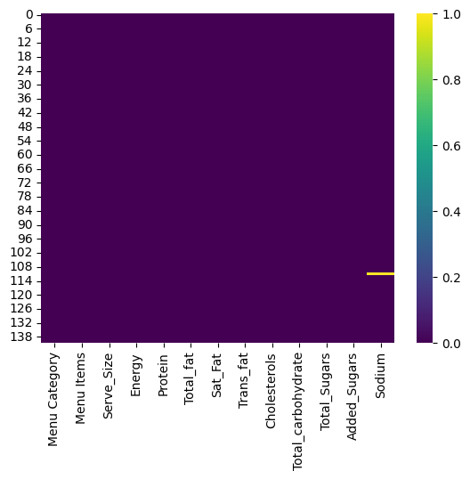
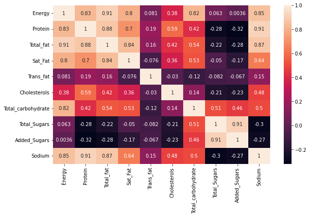
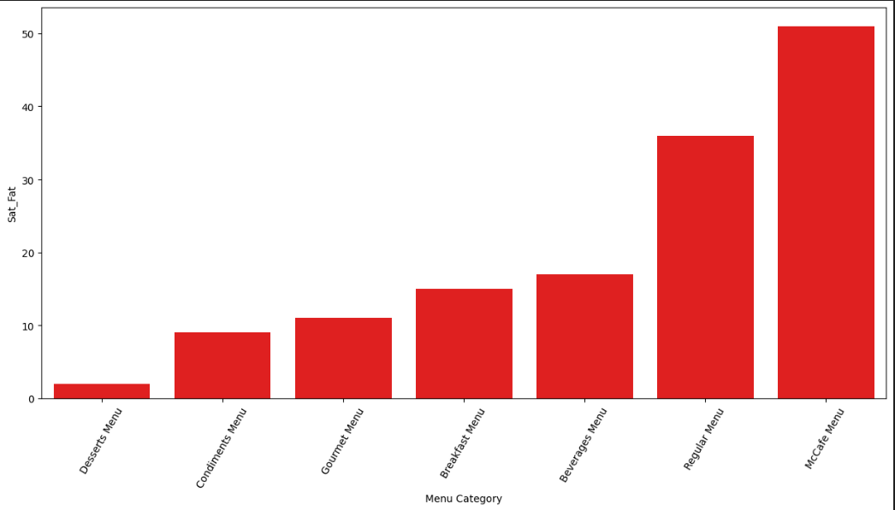
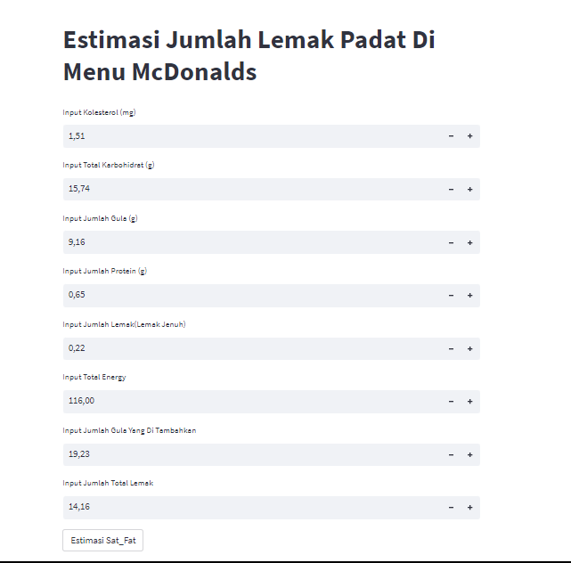

# Laporan Proyek Machine Learning
### Nama : Muhammad Irpan
### Nim : 211351094
### Kelas : Malam A

## Domain Proyek

Proyek ini bertujuan untuk menganalisis dan menggali wawasan dari kumpulan data nutrisi menu McDonald's India. McDonald's adalah salah satu rantai restoran cepat saji terbesar di dunia, dan penawaran mereka dapat berbeda dari negara ke negara. McDonald's India memiliki menu yang disesuaikan dengan preferensi dan budaya masyarakat India.

## Business Understanding

Proyek ini bertujuan  memberikan wawasan yang berguna tentang nutrisi dan harga menu McDonald's India, memungkinkan McDonald's India untuk membuat keputusan yang lebih baik dalam pengembangan menu dan strategi pemasaran. Analisis ini juga dapat mendukung kesadaran nutrisi di antara konsumen dan pemangku kepentingan lainnya.

### Problem Statements

Dalam menghadapi pertumbuhan pesat industri makanan cepat saji dan meningkatnya kesadaran nutrisi di kalangan konsumen, McDonald's India menghadapi beberapa tantangan yang perlu diatasi.

1. Kualitas Nutrisi dalam Menu: Perusahaan perlu memahami komposisi nutrisi dari menu mereka untuk memastikan bahwa konsumen dapat membuat pilihan makanan yang lebih sehat.
2. Kurangnya Kesadaran Nutrisi: Konsumen sering kali tidak memiliki pemahaman yang cukup tentang nutrisi yang terkandung dalam produk makanan yang mereka beli di McDonald's India.

### Goals

Tujuan utama proyek ini adalah memberikan solusi untuk masalah di atas melalui analisis nutrisi menu McDonald's India.

1. Mengedukasi Konsumen: Meningkatkan kesadaran nutrisi di kalangan konsumen McDonald's India melalui informasi yang lebih transparan tentang komposisi nutrisi menu.
2. Peningkatan Kualitas Menu: Mengidentifikasi item-menu yang memerlukan peningkatan dalam nutrisi dan memberikan rekomendasi untuk pengembangan menu yang lebih sehat.

### Solution statements

Solusi untuk tantangan yang dihadapi oleh McDonald's India dalam proyek "McDonald's India Menu Nutrition Dataset" adalah sebagai berikut:

- Peningkatan Menu Sehat: Mengembangkan dan memperkenalkan menu yang lebih sehat dengan memanfaatkan hasil analisis nutrisi untuk mengidentifikasi area peningkatan.
- Edukasi Nutrisi: Meningkatkan kesadaran nutrisi di kalangan konsumen dengan memberikan informasi nutrisi yang lebih detail dan mudah dipahami pada menu.
- Model yang dihasilkan menggunakan Regresi Linier

## Data Understanding

Dari pengumpulan data yang telah diambil dari kaggle mengenai Menu nutrisi McDonalds India, terdapat 13 kolom yang berisi 3 kolom objek, 10 kolom float. ika menggunakan regresi linear, maka hanya kolom yang berisi float saja yang bisa diolah. Berikut atribut-atribut nya.

(https://www.kaggle.com/datasets/deepcontractor/mcdonalds-india-menu-nutrition-facts/data)

### Variabel-variabel pada McDonald's India : Menu Nutrition Dataset Dataset adalah sebagai berikut:

1. Menu Categeory (Golongan)    = objek
2. Menu Items (Nama-nama menu)  = objek
3. Serve_Size                   = objek
4. Energy (Kalori)              = float
5. Protein (Protein)            = float
6. Total_fat (Total Lemak)      = float
7. Sat_fat (Lemak Jenuh)        = float
8. Trans_Fat (Lemak trans)      = float
9. Cholesterol (Kolestrol)      = float
10. Total_Carbohydrate (Total karbohidrat) = float
11. Dietary (Serat Makanan)     = float
12. Total_Sugars (Gula)         = float
13. Sodium (Sodium)             = float

## Data Preparation

## Data Collection

Data ini saya dapatkan dari kaggle tetang McDonald's India : Menu Nutrition Dataset

## Data Discovery And Profiling

- Mengimport library yang di butuhkan

``` bash
import pandas as pd
import numpy as np
import matplotlib.pyplot as plt
import seaborn as sns
```

- Memanggil Dataset yang digunakan

``` bash
df = pd.read_csv('Mcdonalds.csv')
```

- Melihat 5 data yang dipanggil

``` bash
df.head()
```

- Selanjutnya melihat info dari data 
``` bash
df.info()
```

- Pada tahap ini kita menggunakan seaborn dan mengecek apakah terdapat data kosong atau null

``` bash
sns.heatmap(df.isnull())
```
 <br>

- Disini kita akan melihat nilai data

``` bash
df.describe()
```

- Ini adalah bagian visualisasi data mari kita explorasi

``` bash
plt.figure(figsize=(10,6))
sns.heatmap(df.corr(), annot=True)
```
 <br>

- Selanjutnya adalah jumlah satfat berdasarkan size menu

``` bash
brands = df.groupby('Serve_Size').count()[['Protein']].sort_values(by='Protein', ascending=True).reset_index()
brands = brands.rename(columns={'Protein':'Sat_Fat'})
```

``` bash
fig = plt.figure(figsize = (15,7))
sns.barplot(x = brands['Serve_Size'], y = brands['Sat_Fat'], color = 'red')
plt.xticks(rotation = 60)
```

 <br>

## Modeling Data

- Pertama adalahh tahap seleksi fitur

``` bash
fitur = ['Cholesterols', 'Total_carbohydrate', 'Total_Sugars', 'Protein','Trans_fat','Added_Sugars','Total_fat','Energy']
x = df[fitur]
y = df['Sat_Fat']
x.shape, y.shape
```
((141, 4), (141,))

- Ini adalah bagian split data training dan testing

``` bash
from sklearn.model_selection import train_test_split
x_train, X_test, y_train, y_test = train_test_split(x, y, random_state = 70)
y_test.shape
```
(36,)

- Lalu kita akan membuat Regresi Linier

``` bash
from sklearn.linear_model import LinearRegression
lr = LinearRegression()
lr.fit(x_train,y_train)
predik = lr.predict(X_test)
```

## Evaluasi Data Untuk Melihat Akurasi Regresi Linier

``` bash
y = lr.score(X_test, y_test)
print('Akurasi Model Regresi Linier : ', y)
```
Akurasi Model Regresi Linier :  0.9640439754565693

- Membuat Inputan Regresi Linier

``` bash
#Cholesterols (mg) = 25.24 , Total_Carbohydrate (g) = 56.96 , Total_Sugars (g) = 7.85 , Protein (g) = 15.3 , Trans_fat = 0.21,  Added_Sugars = 4.76 , Total_fat = 23.45 , Sat_Fat
inputan = np.array([[25.24, 56.96, 7.85, 15.3, 0.21, 4.76, 23.45, 10.51]])
prediksi = lr.predict(inputan)
print('Estimasi Jumlah Energi dalam setiap size menu  : ', prediksi)
```
Estimasi Jumlah Energi dalam setiap size menu  :  [506.28582489]

## Deployment

[Estimation APP](https://tugasuts-hvfbfmvfkeqr8meeja3hdb.streamlit.app/).

 <br>
